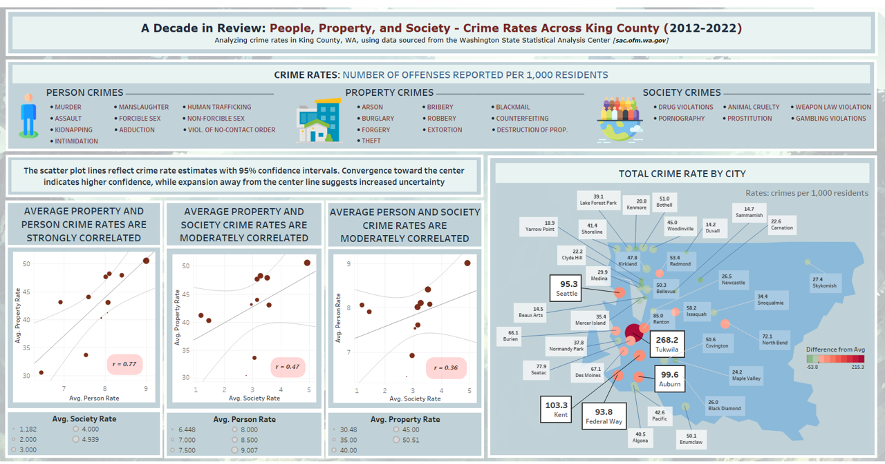

# Bivariate & Uncertainty Dashboard

## Purpose
A static portfolio visualization exploring relationships among crime categories and their spatial distribution across King County, Washington.

## Methods
The dashboard combines a bivariate-style correlation view with scatterplots, Pearson correlation values, confidence bands, and a map of ten-year average crime rates by city. Point size and a stepped diverging color scale support comparisons across locations; annotations call out the highest-rate cities.

## Output
- `bivariate-uncertainty-dashboard.png` — final static dashboard image.
- `project-notes.md` — concise project narrative and provenance notes.

## Visualization

*Static dashboard combining correlation views, uncertainty bands, and a county map of average crime rates.*

## Data sources and permissions
The underlying crime data were sourced from the Washington State Statistical Analysis Center (WSSAC). This repository contains the final visualization and a sanitized narrative, not the original source tables. Confirm current source terms and attribution requirements before reuse.

## Limitations
The dashboard is an exploratory summary and should not be used to infer causation. Aggregation can hide within-city variation, and crime patterns may reflect reporting practices, socioeconomic conditions, policing, and other factors not represented here. The published artifact is static, so interactive filtering is unavailable.

## Reproducibility
The original dashboard build environment and source data are not included. To reproduce or extend the work, obtain the relevant WSSAC data, document the extraction date and transformations, then recreate the correlation and map views using the methods above.
